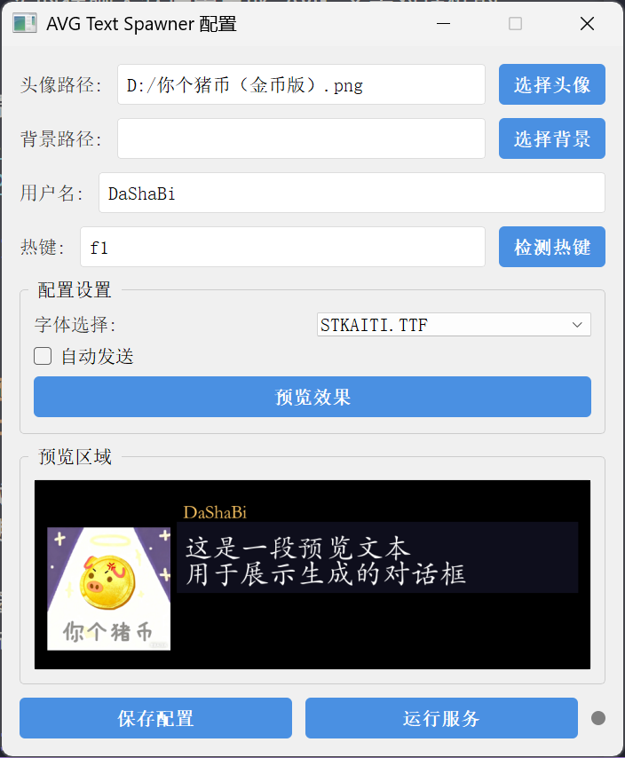

# AVG Text Spawner

效果预览：

GUI页面：

## 简介

一个用于实时在聊天软件中生成 AVG 文字对话框的 Python 脚本。

灵感来源：[魔法少女的魔女裁判文本框脚本](https://github.com/oplivilqo/Text_box-of-mahoushoujo_no_majosaiban)

## 使用方法

打开`configGUI.exe`，根据提供的选项进行配置。

**目前还不能做实时配置，只能每次手动点击保存配置，以后会加上实时监听实时修改。**

配置完成之后，点击右下角`运行服务`按钮，等控制台弹出后即可使用。

在聊天窗口中输入文本，按设置的热键生成对话框，就可以生成图片并自动发送。

## 主要功能

1. **配置设置**：
   - 头像路径：选择对话框中显示的头像图片
   - 背景路径：选择对话框的背景图片
   - 用户名：设置对话框中显示的用户名
   - 热键：设置触发对话框生成的快捷键（支持组合键）
   - 字体选择：从系统字体中选择对话框文本的字体
   - 自动发送：开启后，对话框生成后自动发送到聊天窗口

2. **预览功能**：
   - 实时预览对话框效果，所见即所得
   - 预览区域会显示当前配置下的对话框样式

3. **服务管理**：
   - 保存配置：将当前设置保存到 config.json 文件
   - 运行/停止服务：启动或停止后台服务
   - 状态指示灯：显示服务运行状态（灰色=停止，绿色=运行中，红色=错误）

## 注意事项

- 热键设置在 Linux 系统需要 root 权限
- 图片文件支持 PNG、JPG、JPEG 格式
- 配置文件为 config.json，可手动编辑
- 服务启动后，会在后台运行，监听热键事件

